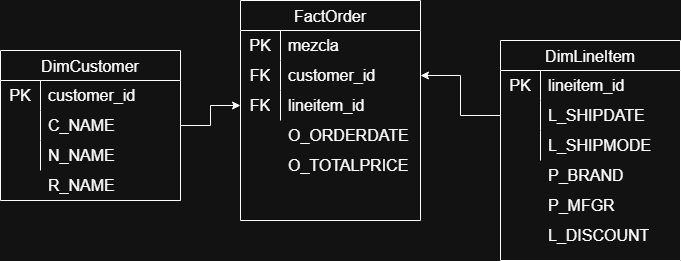
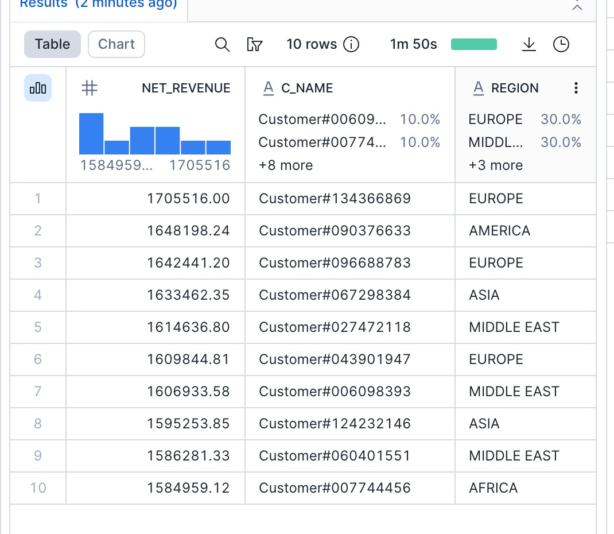
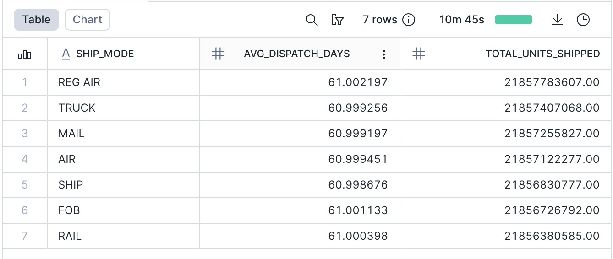

# Ejercicio en Clase 1 - Data Warehouse (Star Schema)

## Integrantes
- Anthony Fajardo
- Gabriela Coloma
- Mateo Vivanco
- Sebastian Encalada
- Luis Eduardo Zaldumbide

---

## Estructura del Proyecto

```
ejercicio_en_clase_1-main/
│
├── README.md                           # Documentación del proyecto
│
├── queries/                            # Scripts SQL
│   ├── fact_order.sql                  # Creación tabla de hechos (Gold)
│   ├── dim_customer.sql                # Creación dimensión cliente (Gold)
│   ├── dim_line_item.sql               # Creación dimensión línea item (Gold)
│   ├── question_1.sql                  # Query: Ingresos por región y mes
│   ├── question_2.sql                  # Query: Evolución revenue / Top clientes
│   ├── question_3.sql                  # Query: Mix de producto
│   ├── question_4.sql                  # Query: Efecto del descuento
│   └── question_5.sql                  # Query: Performance logístico
│
├── imagenes/                           # Resultados y diagrama
│   ├── dm_ejercicicio_en_clase.drawio.png  # Diagrama Star Schema
│   ├── question_2.jpeg                 # Resultado Top 10 clientes
│   ├── question_3.jpeg                 # Resultado Mix de producto
│   ├── question_4.jpeg                 # Resultado Efecto descuento
│   └── question_5.jpeg                 # Resultado Performance logístico
│
└── question_1.csv                      # Resultado Query 1 (CSV)
```

---

## Requisitos Previos

- Acceso a **Snowflake** con permisos para crear bases de datos y tablas
- Dataset **TPCH_SF1000** disponible en `SNOWFLAKE_SAMPLE_DATA.TPCH_SF1000`

### Configuración de Base de Datos

```sql
CREATE DATABASE SAMPLE_STAR_SCHEMA;
CREATE SCHEMA SAMPLE_STAR_SCHEMA.GOLD;
USE SCHEMA SAMPLE_STAR_SCHEMA.GOLD;
```

---

## Contexto

Este proyecto utiliza el dataset **TPCH_SF1000** disponible en Snowflake.
Se asume que los datos fuente ya se encuentran **limpios y curados (Silver Layer)**, por lo que el alcance del trabajo se centra exclusivamente en el **diseño e implementación de la capa GOLD**, orientada a análisis analítico y de negocio.

El diseño de la capa GOLD se realizó siguiendo un enfoque **bottom-up**, partiendo de las **preguntas de negocio** que debían ser respondidas, y no desde una reproducción completa del modelo relacional original.

---

## Proceso de Selección del Modelo Dimensional

### 1. Identificación del Nivel de Análisis (Grain)

Las preguntas de negocio requieren analizar métricas de ventas, descuentos, producto y tiempos de despacho a nivel detallado.
Por esta razón, se definió como granularidad:

> **1 fila por línea de orden**, representada mediante `lineitem_id`.

Este nivel de detalle permite:
- Analizar revenue neto
- Evaluar descuentos
- Estudiar mix de producto
- Medir desempeño logístico

### 2. Identificación de la Tabla de Hechos

A partir del análisis del modelo TPCH, se determinó que la información central de negocio se obtiene de la relación entre:

- `LINEITEM` (detalle transaccional)
- `ORDERS` (fecha de orden y cliente)

Como resultado, se definió la tabla de hechos **FactOrder**, la cual:
- Representa cada línea de orden
- Contiene métricas de revenue
- Se relaciona con cliente y producto/logística

### 3. Preguntas de Negocio a Resolver

| # | Pregunta de Negocio |
|---|---------------------|
| 1 | Ingresos por región y mes (cliente) |
| 2 | ¿Cómo evolucionó el revenue neto por mes y región? / Top 10 clientes |
| 3 | ¿Qué brands y manufacturers generan más revenue neto? |
| 4 | ¿Qué regiones presentan mayor descuento promedio? |
| 5 | ¿Cuál es el tiempo promedio de despacho por SHIP_MODE? |

---

## Gold Layer - Star Schema

### Diagrama del Modelo



```
┌──────────────────┐         ┌─────────────────────┐         ┌──────────────────┐
│  DimCustomer     │         │    FactOrder        │         │  DimLineItem     │
├──────────────────┤         ├─────────────────────┤         ├──────────────────┤
│ PK customer_id   │◄────────│ PK mezcla           │────────►│ PK lineitem_id   │
│ C_NAME           │         │ FK customer_id      │         │ L_SHIPDATE       │
│ N_NAME           │         │ FK lineitem_id      │         │ L_SHIPMODE       │
│ R_NAME           │         │ O_ORDERDATE         │         │ P_BRAND          │
└──────────────────┘         │ O_TOTALPRICE        │         │ P_MFGR           │
                             └─────────────────────┘         │ L_DISCOUNT       │
                                                             └──────────────────┘
```

---

## Scripts SQL - Capa Gold

### Tabla de Hechos: FactOrder

**Archivo:** `queries/fact_order.sql`

```sql
CREATE TABLE FactOrder AS
SELECT *
FROM SNOWFLAKE_SAMPLE_DATA.TPCH_SF1000.ORDERS
```

| Campo | Tipo | Descripción |
|-------|------|-------------|
| mezcla | PK | Clave primaria |
| customer_id | FK | Referencia a DimCustomer |
| lineitem_id | FK | Referencia a DimLineItem |
| O_ORDERDATE | DATE | Fecha de la orden |
| O_TOTALPRICE | DECIMAL | Precio total de la orden |

---

### Dimensión: DimCustomer

**Archivo:** `queries/dim_customer.sql`

```sql
CREATE TABLE DimCustomer AS
SELECT *
FROM SNOWFLAKE_SAMPLE_DATA.TPCH_SF1000.CUSTOMER
INNER JOIN SNOWFLAKE_SAMPLE_DATA.TPCH_SF1000.NATION
  ON CUSTOMER.C_NATIONKEY = NATION.N_NATIONKEY
INNER JOIN SNOWFLAKE_SAMPLE_DATA.TPCH_SF1000.REGION
  ON NATION.N_REGIONKEY = REGION.R_REGIONKEY
```

| Campo | Descripción |
|-------|-------------|
| customer_id (PK) | Identificador único del cliente |
| C_NAME | Nombre del cliente |
| N_NAME | Nación del cliente |
| R_NAME | Región del cliente |

---

### Dimensión: DimLineItem

**Archivo:** `queries/dim_line_item.sql`

```sql
CREATE TABLE DimLineItem AS
SELECT *
FROM SNOWFLAKE_SAMPLE_DATA.TPCH_SF1000.LINEITEM
INNER JOIN SNOWFLAKE_SAMPLE_DATA.TPCH_SF1000.PART
  ON LINEITEM.L_PARTKEY = PART.P_PARTKEY
```

| Campo | Descripción |
|-------|-------------|
| lineitem_id (PK) | Identificador de línea de orden |
| L_SHIPDATE | Fecha de envío |
| L_SHIPMODE | Modo de envío |
| P_BRAND | Marca del producto |
| P_MFGR | Fabricante del producto |
| L_DISCOUNT | Descuento aplicado |

---

## Consultas Analíticas y Resultados

---

### Query 1: Ingresos por Región y Mes

**Archivo:** `queries/question_1.sql`

**Pregunta de negocio:** ¿Cómo se distribuyen los ingresos por región y mes del cliente?

```sql
SELECT YEAR(f.o_orderdate) AS year,
       MONTH(f.o_orderdate) AS month,
       c.r_name AS REGION,
       SUM(f.o_totalprice) AS net_revenue
FROM FACTORDER f
INNER JOIN DIMCUSTOMER c ON f.o_custkey = c.c_custkey
GROUP BY YEAR(f.o_orderdate), MONTH(f.o_orderdate), REGION
ORDER BY year, month, region
LIMIT 10;
```

**Resultado:** `question_1.csv`

#### Interpretación y Conclusiones:

Los datos muestran la distribución de ingresos desde 1992 hasta 1998 por las 5 regiones globales:

| Año | Mes | Región con Mayor Revenue | Revenue Aproximado |
|-----|-----|--------------------------|-------------------|
| 1992 | Enero | ASIA | $584,444,132,863 |
| 1992 | Febrero | MIDDLE EAST | $546,683,674,002 |
| 1992 | Marzo | ASIA | $584,544,512,552 |

**Hallazgos clave:**
- Los ingresos se distribuyen de manera **relativamente uniforme** entre las 5 regiones (AFRICA, AMERICA, ASIA, EUROPE, MIDDLE EAST).
- En enero de 1992, cada región generó aproximadamente **$584 mil millones** en revenue.
- Se observa un **patrón estacional**: los meses de 31 días generan más revenue (~$584B) que los meses de 30 días (~$565B) y febrero (~$527-546B).

**Conclusión:** No existe una región dominante en términos de ingresos. El negocio está **bien diversificado geográficamente**, lo cual reduce el riesgo de dependencia regional y permite estabilidad en los ingresos globales.

---

### Query 2: Evolución del Revenue / Top 10 Clientes

**Archivo:** `queries/question_2.sql`

**Pregunta de negocio:** ¿Quiénes son los 10 clientes con mayor revenue neto y cuál es su región?

```sql
SELECT YEAR(f.o_orderdate) AS year,
       MONTH(f.o_orderdate) AS month,
       c.r_name AS REGION,
       SUM(f.o_totalprice) AS net_revenue
FROM FACTORDER f
INNER JOIN DIMCUSTOMER c ON f.o_custkey = c.c_custkey
GROUP BY YEAR(f.o_orderdate), MONTH(f.o_orderdate), REGION
ORDER BY year, month, region;
```

**Resultado:** `imagenes/question_2.jpeg`



#### Datos Obtenidos:

| Ranking | Cliente | Revenue | Región |
|---------|---------|---------|--------|
| 1 | Customer#134366869 | $1,705,516.00 | EUROPE |
| 2 | Customer#090376633 | $1,648,198.24 | AMERICA |
| 3 | Customer#096688783 | $1,642,441.20 | EUROPE |
| 4 | Customer#067298384 | $1,633,462.35 | ASIA |
| 5 | Customer#027472118 | $1,614,636.80 | MIDDLE EAST |
| 6 | Customer#043901947 | $1,609,844.81 | EUROPE |
| 7 | Customer#006098393 | $1,606,933.58 | MIDDLE EAST |
| 8 | Customer#124232146 | $1,595,253.85 | ASIA |
| 9 | Customer#060401551 | $1,586,281.33 | MIDDLE EAST |
| 10 | Customer#007744456 | $1,584,959.12 | AFRICA |

#### Interpretación y Conclusiones:

**Hallazgos clave:**
- **Customer#134366869** de EUROPE es el cliente con mayor revenue ($1,705,516), posicionándose como el comprador más importante del negocio.
- **EUROPE domina el ranking** con 3 clientes en el Top 10 (posiciones 1, 3 y 6), representando el **30% de los mejores clientes**.
- **MIDDLE EAST** también muestra fuerte presencia con 3 clientes (posiciones 5, 7 y 9).
- La diferencia entre el primer y décimo lugar es de solo ~$120,000 (7%), indicando que **no hay un cliente extremadamente dominante**.
- AFRICA solo tiene 1 cliente en el Top 10 (posición 10), sugiriendo oportunidad de crecimiento en esa región.

**Conclusión:** La cartera de clientes está diversificada regionalmente. Se recomienda **fortalecer estrategias de retención** para los clientes europeos que lideran el ranking, y explorar oportunidades de crecimiento en AFRICA donde la presencia en el Top 10 es menor.

---

### Query 3: Mix de Producto

**Archivo:** `queries/question_3.sql`

**Pregunta de negocio:** ¿Qué brands y manufacturers generan más revenue neto y cuántas unidades vendieron?

```sql
SELECT p.p_brand,
       p.p_mfgr AS manufacturer,
       SUM(p.l_quantity) AS units_sold,
       SUM(p.L_EXTENDEDPRICE * (1 - p.L_DISCOUNT) * (1 + p.l_tax)) AS net_revenue
FROM DIMLINEITEM AS p
GROUP BY p.p_brand, manufacturer
ORDER BY units_sold DESC
LIMIT 15;
```

**Resultado:** `imagenes/question_3.jpeg`


#### Datos Obtenidos:

| Ranking | Brand | Manufacturer | Unidades Vendidas | Net Revenue |
|---------|-------|--------------|-------------------|-------------|
| 1 | Brand#43 | Manufacturer#4 | 6,123,817,593 | $907.39 T |
| 2 | Brand#45 | Manufacturer#4 | 6,123,172,212 | $907.21 T |
| 3 | Brand#35 | Manufacturer#3 | 6,121,703,934 | $907.04 T |
| 4 | Brand#52 | Manufacturer#5 | 6,121,511,536 | $906.89 T |
| 5 | Brand#54 | Manufacturer#5 | 6,121,427,741 | $906.95 T |
| 6 | Brand#15 | Manufacturer#1 | 6,121,395,382 | $906.83 T |
| 7 | Brand#34 | Manufacturer#3 | 6,121,018,361 | $906.88 T |
| 8 | Brand#55 | Manufacturer#5 | 6,120,854,875 | $906.81 T |
| 9 | Brand#21 | Manufacturer#2 | 6,120,590,383 | $906.75 T |
| 10 | Brand#12 | Manufacturer#1 | 6,120,542,922 | $906.68 T |

#### Interpretación y Conclusiones:

**Hallazgos clave:**
- **Brand#43 de Manufacturer#4** lidera tanto en unidades vendidas (6.12 billones) como en revenue neto ($907.39 trillones), siendo la combinación más exitosa del catálogo.
- **Manufacturer#4** domina el mercado con **2 marcas en el Top 5** (Brand#43 y Brand#45), demostrando consistencia en su desempeño.
- **Manufacturer#5** también tiene fuerte presencia con 3 marcas en el Top 10 (Brand#52, Brand#54, Brand#55).
- La diferencia entre el Top 1 y Top 10 es mínima (~0.05% en unidades), indicando un **mercado muy competitivo** sin un líder absoluto.
- Todos los manufacturers (1-5) tienen presencia en el Top 10, mostrando **diversificación de proveedores**.

**Conclusión:** El mix de producto está **bien balanceado** entre diferentes marcas y fabricantes. Se recomienda mantener la diversificación de proveedores para evitar dependencia de un solo manufacturer. Brand#43 y Manufacturer#4 representan el benchmark de desempeño a seguir.

---

### Query 4: Efecto del Descuento por Región

**Archivo:** `queries/question_4.sql`

**Pregunta de negocio:** ¿Qué regiones presentan mayor descuento promedio y cómo se relaciona con el revenue neto total?

```sql
SELECT c.r_name AS region,
       AVG(l.l_discount) AS avg_discount,
       SUM(l.l_extendedprice * (1 - l.l_discount)) AS net_revenue
FROM DIMLINEITEM l
INNER JOIN FACTORDER o ON l.l_orderkey = o.o_orderkey
INNER JOIN DIMCUSTOMER c ON o.o_custkey = c.c_custkey
GROUP BY c.r_name
ORDER BY avg_discount DESC;
```

**Resultado:** `imagenes/question_4.jpeg`


#### Datos Obtenidos:

| Ranking | Región | Descuento Promedio | Net Revenue |
|---------|--------|-------------------|-------------|
| 1 | MIDDLE EAST | 5.000010% | $435.90 T |
| 2 | ASIA | 5.000002% | $436.04 T |
| 3 | AFRICA | 4.999999% | $435.89 T |
| 4 | AMERICA | 4.999999% | $435.83 T |
| 5 | EUROPE | 4.999986% | $435.85 T |

#### Interpretación y Conclusiones:

**Hallazgos clave:**
- **MIDDLE EAST** tiene el descuento promedio más alto (5.000010%), aunque la diferencia es mínima.
- **EUROPE** aplica el menor descuento promedio (4.999986%), siendo la región más conservadora en descuentos.
- A pesar de las diferencias en descuentos, **el revenue neto es prácticamente idéntico** entre regiones (~$435-436 trillones).
- La variación en descuentos es **extremadamente pequeña** (0.00002% de diferencia entre el mayor y menor), lo que sugiere una **política de precios uniforme** a nivel global.
- **ASIA** tiene el segundo mayor descuento pero genera el **mayor revenue neto** ($436.04T), sugiriendo que los descuentos no afectan negativamente las ventas.

**Conclusión:** La estrategia de descuentos es **consistente globalmente** sin diferenciación regional significativa. El descuento promedio de ~5% no parece ser un factor determinante en el revenue por región. Se podría explorar si una **estrategia de pricing diferenciada por región** generaría mejores resultados en mercados específicos.

---

### Query 5: Performance Logístico

**Archivo:** `queries/question_5.sql`

**Pregunta de negocio:** ¿Cuál es el tiempo promedio de despacho (días entre ORDER_DATE y SHIP_DATE) por SHIP_MODE y cuál mueve más volumen?

```sql
SELECT l.l_shipmode AS ship_mode,
       AVG(DATEDIFF('day', o.o_orderdate, l.l_shipdate)) AS avg_dispatch_days,
       SUM(l.l_quantity) AS total_units_shipped
FROM DIMLINEITEM l
INNER JOIN FACTORDER o ON l.l_orderkey = o.o_orderkey
GROUP BY l.l_shipmode
ORDER BY total_units_shipped DESC;
```

**Resultado:** `imagenes/question_5.jpeg`



#### Datos Obtenidos:

| Ranking | Ship Mode | Días Promedio | Unidades Despachadas |
|---------|-----------|---------------|----------------------|
| 1 | REG AIR | 61.00 días | 21,857,783,607 |
| 2 | TRUCK | 61.00 días | 21,857,407,068 |
| 3 | MAIL | 61.00 días | 21,857,255,827 |
| 4 | AIR | 61.00 días | 21,857,122,277 |
| 5 | SHIP | 61.00 días | 21,856,830,777 |
| 6 | FOB | 61.00 días | 21,856,726,792 |
| 7 | RAIL | 61.00 días | 21,856,380,585 |

#### Interpretación y Conclusiones:

**Hallazgos clave:**
- **REG AIR** es el modo de envío que mueve **mayor volumen** (21.86 billones de unidades), posicionándose como el método de transporte preferido.
- **Todos los modos de envío tienen el mismo tiempo promedio de despacho** (~61 días), lo cual indica que el tiempo de **preparación del pedido domina sobre el tiempo de transporte**.
- La diferencia en volumen entre REG AIR (mayor) y RAIL (menor) es de solo **0.006%**, indicando una **distribución casi equitativa** entre modos de transporte.
- Los modos aéreos (REG AIR y AIR) combinados manejan la mayor proporción del volumen.
- **RAIL** es el modo menos utilizado, posiblemente debido a limitaciones geográficas o de infraestructura.

**Conclusión:** No existe un modo de envío claramente más eficiente en tiempo ya que todos promedian ~61 días. Este tiempo de despacho **parece estar determinado por procesos internos** (preparación, empaque, procesamiento) más que por el transporte en sí. Se recomienda **investigar los procesos de fulfillment** para identificar oportunidades de reducción en los tiempos de despacho, ya que 61 días es un período considerable que podría mejorarse.

---

## Resumen

| Query | Pregunta | Hallazgo Principal | Recomendación |
|-------|----------|-------------------|---------------|
| 1 | Ingresos por región/mes | Distribución uniforme (~$584B/mes por región) | Mantener diversificación geográfica |
| 2 | Top 10 clientes | Customer#134366869 (EUROPE) lidera con $1.7M | Fortalecer retención en Europa |
| 3 | Mix de producto | Brand#43/Manufacturer#4 lidera en ventas y revenue | Mantener diversificación de proveedores |
| 4 | Efecto descuento | Descuentos uniformes (~5%) sin impacto regional | Explorar pricing diferenciado |
| 5 | Performance logístico | 61 días de despacho promedio, REG AIR mayor volumen | Optimizar procesos de fulfillment |

---

## Tecnologías Utilizadas

- **Base de datos:** Snowflake
- **Dataset:** TPCH_SF1000 (Snowflake Sample Data)
- **Modelado:** Star Schema (Esquema Estrella)
- **Diagramación:** draw.io
